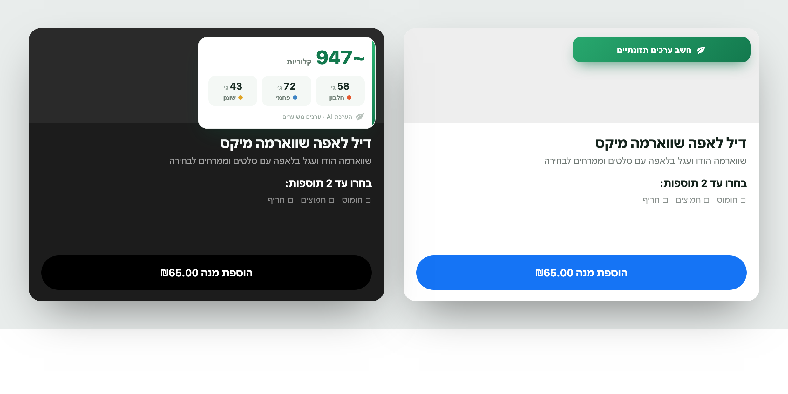

# Nutrition Overlay for Wolt & 10bis

A Chrome extension that adds **AI‑estimated calories + macros** (protein / carbs / fat)
to menu items on **wolt.com** and **10bis.co.il** — with the total updating live as you
pick add‑ons.



> ⚠️ Values are **AI estimates** and approximate — not a substitute for official
> nutrition information or medical advice.

## Features

- 🥗 Estimated **calories + protein / carbs / fat** for any dish.
- 👆 **On demand** — open an item and tap **“חשב ערכים תזונתיים” (Calculate nutrition)**;
  nothing is sent until you ask.
- ➕ **Live totals** — toggle add‑ons (fries, rice, extras) and the total updates instantly,
  with no extra API calls.
- ⚡ **Fast** — one grouped request per item using Google **Gemini 2.5 Flash** (a few seconds).
- 💾 **Cached** — each item is only looked up once.
- 🔒 **Local & private** — your API key and cached results live only in your browser.
- 🌐 Runs **only** on `wolt.com` and `10bis.co.il`, with a right‑to‑left Hebrew UI.

## Install (unpacked)

1. Download and unzip `nutrition-overlay.zip` (or build it yourself — see below).
2. Open `chrome://extensions` and turn on **Developer mode** (top‑right).
3. Click **Load unpacked** and select the unzipped folder (the one containing `manifest.json`).
4. Open the extension’s **Details → Extension options**, paste a **free** Gemini API key from
   <https://aistudio.google.com/apikey>, and click **Save**.
5. Open any item on Wolt or 10bis and click **Calculate nutrition**.

Each person uses their **own** free Gemini key — it’s stored locally and only used to call Google.

## How it works

- A **content script** (with a small per‑site adapter for Wolt and 10bis) reads the dish’s
  name, description, and option labels from the page and injects the nutrition widget,
  right‑aligned, just above the options.
- A **background service worker** holds the API key and sends one grouped request — the dish
  plus all of its options — to Gemini (with a small thinking budget), validates the JSON, and
  caches every result by a hash of the text.
- Toggling options recomputes `base + Σ(selected)` **client‑side** — no further API calls.
- The extension is bundled into self‑contained scripts (esbuild), so it runs on these sites’
  strict Content‑Security‑Policy without loading any remote code.

## Build from source

```bash
npm install
npm run build       # outputs dist/  (load this unpacked)
npm test            # unit + adapter tests (Vitest, against real captured DOM fixtures)
npm run typecheck   # tsc --noEmit
```

Package a shareable zip:

```bash
npm run build
cd dist && zip -r ../nutrition-overlay.zip . && cd ..
```

The site‑specific selectors live in `src/content/adapters/{wolt,tenbis}.ts` and are tested
against real captured markup in `tests/fixtures/`. If a site changes its markup and the widget
stops appearing, re‑capture a fixture and adjust that adapter.

## CI & releases

- **CI** (`.github/workflows/ci.yml`) runs lint + type‑check + tests + build on every push and
  PR, and uploads the packaged `nutrition-overlay.zip` as a downloadable run **artifact**.
- **Release** (`.github/workflows/release.yml`) is triggered by a version tag and publishes a
  GitHub Release with the zip attached.

To cut a release:

```bash
# 1. bump "version" in manifest.json (e.g. 0.1.0 -> 0.2.0), commit, then:
git tag v0.2.0
git push origin v0.2.0
```

The workflow builds the extension, syncs the manifest version to the tag, and publishes
**`nutrition-overlay-v0.2.0.zip`** on the Release page (with auto‑generated notes). Share that
zip's URL, or upload it to the Chrome Web Store.

## Privacy

Only menu item **text** (names, descriptions, option labels) is sent to Google Gemini to
estimate nutrition. No accounts, tracking, analytics, or servers. Your API key and cached
estimates stay in your browser. See [`PRIVACY.md`](PRIVACY.md) for the full policy.

## Chrome Web Store

Listing copy (EN + HE), single‑purpose statement, permission justifications, and a submission
checklist are in [`STORE-LISTING.md`](STORE-LISTING.md). Icons (16/48/128) are in `icons/`.

## Tech stack

TypeScript · Manifest V3 · esbuild · Vitest + jsdom · Google Gemini API.

## License

[MIT](LICENSE).
